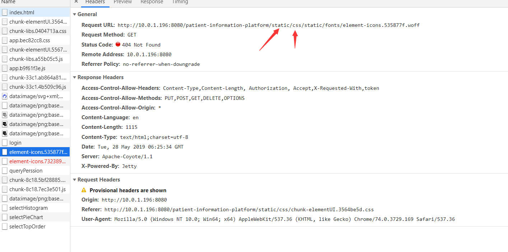

## Jenkins

> 使用jenkins自动打包部署项目，font字体文件找不到？ windows系统打包正常，可以加载。。
***



> 这是因为打包生成的文件 大小超出了 webpack配置打包文件的大小，
在webpack.base.config.js修改默认limit大小。

```
{
  test: /\.(woff2?|eot|ttf|otf)(\?.*)?$/,
  loader: 'url-loader',
  options: {
    limit: 100000, //修改值大于打包生成的文件大小即可
    name: utils.assetsPath('fonts/[name].[hash:7].[ext]')
  }
}

```
